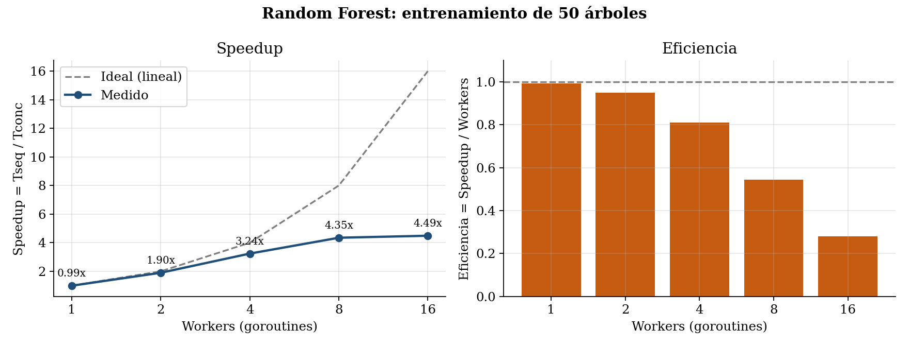
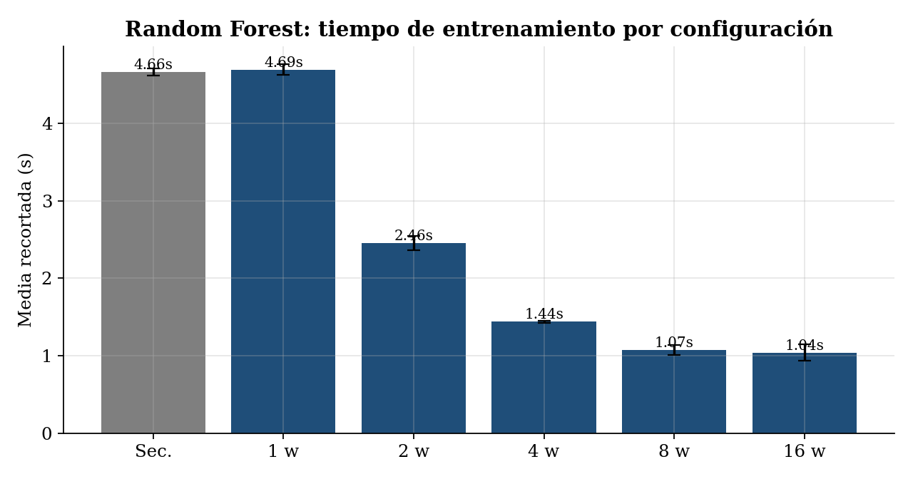
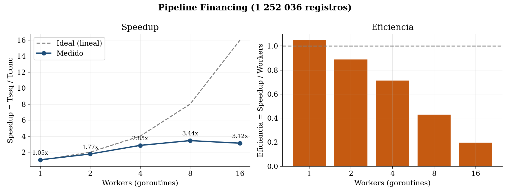
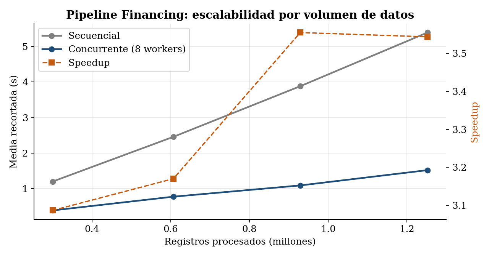
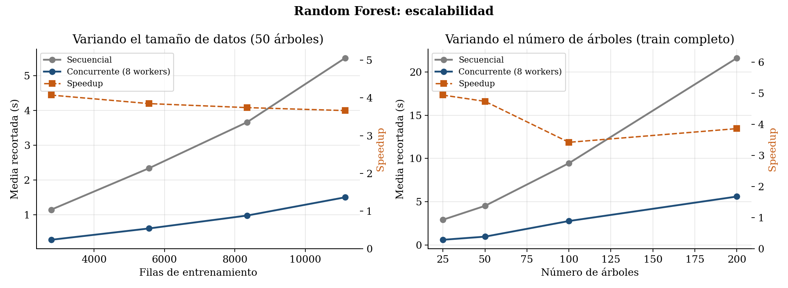
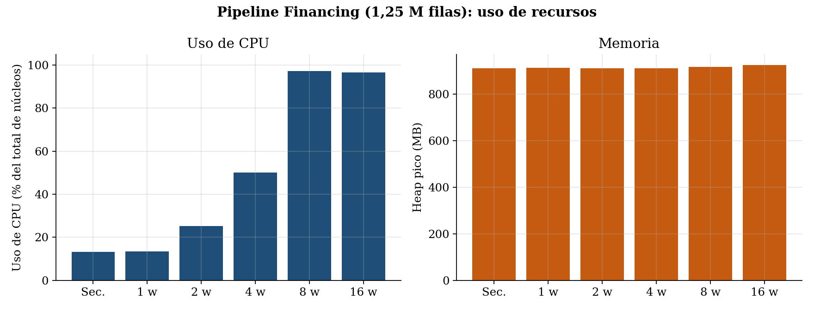

# Informe PC2 – Programación Concurrente y Distribuida (CC65)

**Caso de uso:** predicción del éxito de proyectos de ayuda al desarrollo (ODS 17 – Alianzas para lograr los objetivos)
**Modelo:** clasificación con árboles de decisión (Random Forest)
**Docente:** Carlos Alberto Jara García
**Integrantes:** Leonardo Bravo · Sergio Andres Saavedra Cervera · Raul Andres Cerreño Zevalios
**Repositorio:** https://github.com/hexed-AAL1X/Omega

> Este documento continúa el informe de la PC1 (con sus correcciones) y cubre los puntos i–n de la PC2.

---

## Entorno de ejecución

| Elemento | Valor |
|---|---|
| CPU | Intel Core i5-1135G7 (4 núcleos físicos, 8 hilos) |
| RAM | 16 GB |
| Sistema operativo | Linux (kernel 7.0), gobernador de CPU `powersave` |
| Lenguaje | Go 1.26.1, solo biblioteca estándar (`sync`, `encoding/csv`, `runtime/metrics`) |
| Verificación | Spin 6.5.2 + gcc |

Los datos de entrada son `datasets/csv/model_table.csv` (20 623 proyectos PPD2 enriquecidos, 13 915 válidos para el modelo) y `FinancingtotheSDGsDataset_v1.0.csv` (**1 252 036 registros**, 465 MB).

---

## i. Modelado inicial en Promela

Se modelaron los dos algoritmos concurrentes implementados en Go, más una variante defectuosa para evidenciar que la sincronización es necesaria. Todos los modelos están en `promela/` y se verifican con `./promela/verificar.sh`, que guarda la salida de Spin en `promela/resultados/`.

| Modelo | Qué representa | Propiedad verificada | Estados | Errores |
|---|---|---|---|---|
| `worker_pool.pml` | Pool de 3 workers que entrenan 4 árboles; canal `jobs`, mutex, contador `done`, espera tipo `WaitGroup` | Aserciones + ausencia de deadlock (estados finales inválidos) | 60 180 | **0** |
| `worker_pool.pml` | Mismo modelo | LTL `[] (in_cs <= 1)` (exclusión mutua) | 60 180 | **0** |
| `worker_pool.pml` | Mismo modelo | LTL `<> terminado` (terminación, con equidad débil) | 60 179 | **0** |
| `pipeline.pml` | Pipeline de Financing: bloques → 2 workers → canal de parciales → combinador; goroutine que cierra el canal | Aserción `total == esperado` + ausencia de deadlock | 246 312 | **0** |
| `pipeline.pml` | Mismo modelo | LTL `<> terminado` | 246 231 | **0** |
| `worker_pool_sin_mutex.pml` | Pool sin mutex: `done++` como leer–sumar–escribir | Aserción `done == NTREES` | 1 112 | **1 (violación)** |

**Lógica del modelo del worker pool:**

- `Main` lanza `W` workers, envía los índices de árbol `0..NTREES-1` por el canal `jobs` y luego `W` marcas `FIN` (equivalente a `close(jobs)`).
- Cada worker recibe un índice, entra a la sección crítica con `lock()` (`atomic { mutex == 0 -> mutex = 1 }`), incrementa `in_cs`, comprueba `in_cs == 1`, marca `trees[j]`, incrementa `done` y libera.
- `pendientes` modela el `WaitGroup`: cada worker lo decrementa al terminar y `Main` se bloquea en `pendientes == 0` (equivalente a `wg.Wait()`).
- Al final se comprueba `done == NTREES` y que todos los árboles fueron entrenados exactamente una vez.

**Resultado:** Spin exploró todo el espacio de estados sin encontrar violaciones de aserción, estados finales inválidos (deadlock) ni ciclos de aceptación. El modelo sin mutex produce un contraejemplo (`promela/resultados/worker_pool_sin_mutex_contraejemplo.txt`): dos workers leen el mismo valor de `done`, ambos escriben `done+1` y se pierde una actualización. Esto demuestra que el diseño con mutex está **libre de condición de carrera** y que quitar el mutex la introduce.

---

## j. Implementación en Go (secuencial vs. concurrente)

| Paquete / comando | Contenido |
|---|---|
| `rfcore/` | Lectura del CSV, imputación por mediana (solo con train), árbol CART con Gini, Random Forest balanceado, métricas |
| `cmd/secuencial`, `cmd/concurrente` | Entrenan y evalúan el bosque en cada modo |
| `cmd/benchmark` | Speedup del Random Forest por número de workers |
| `cmd/escalabilidad` | Speedup variando filas de entrenamiento y número de árboles |
| `pipeline/`, `cmd/pipeline` | Agregación concurrente de los 1,25 M registros de Financing por país y año |
| `recursos/` | Medición de tiempo, CPU y memoria con `runtime/metrics` |

Comandos principales:

```bash
go run ./cmd/secuencial
go run ./cmd/concurrente -workers 8
go run ./cmd/benchmark -reps 10 -workers 1,2,4,8,16
go run ./cmd/escalabilidad -reps 5
go run ./cmd/pipeline -reps 10
go run -race ./cmd/concurrente
```

**Correctitud:**

- El bosque concurrente es **idéntico** al secuencial. Cada árbol `i` usa la semilla `seed + i`, así que el resultado no depende del orden en que los workers lo entrenen. Los comandos de benchmark lo comprueban en cada configuración comparando las predicciones.
- El pipeline concurrente produce los mismos 2 573 grupos país-año, con los mismos conteos y sumas (tolerancia 1e-6), que la versión secuencial.
- `go run -race` terminó con 0 advertencias `DATA RACE` en ambos algoritmos.

**Calidad del modelo (test, 2 783 proyectos):** balanced accuracy 0,619 y recall de fracaso 0,587 (el baseline de clase mayoritaria tiene balanced accuracy 0,5).

*(Insertar capturas de la ejecución de `cmd/secuencial`, `cmd/concurrente`, `cmd/benchmark`, `cmd/pipeline` y `go run -race`.)*

---

## k. Algoritmo concurrente y mecanismos de sincronización

### Worker Pool – entrenamiento del Random Forest (`rfcore/forest.go`)

1. Se crea un canal con buffer `jobs` con los índices `0..nTrees-1` y se cierra.
2. Se lanzan `workers` goroutines; cada una hace `for i := range jobs` y entrena el árbol `i` con su propio `rand.Rand`, así que no se comparte estado aleatorio.
3. La escritura de `trees[i]` y el incremento del contador `done` se protegen con **`sync.Mutex`**.
4. **`sync.WaitGroup`** espera a que todos los workers terminen; luego se valida `done == nTrees`.

Los datos `X` e `y` se comparten **solo en lectura**, así que no necesitan sincronización. El trabajo por árbol es grande (bootstrap balanceado + construcción CART), lo que hace que el costo de sincronizar sea despreciable.

### Pipeline con fan-out / fan-in – Financing (`pipeline/financing.go`)

1. **Etapa 1 – partición:** el cuerpo del CSV se divide en `workers × 8` bloques que siempre cortan en `\n`, así que ningún registro queda partido. Los bloques se envían por el canal `tareas`.
2. **Etapa 2 – procesamiento (fan-out):** cada worker parsea sus bloques con `encoding/csv` y acumula en un mapa **local** por (país, año): filas, donantes distintos, USD neto y bruto, descompromisos y las 17 metas ODS.
3. **Etapa 3 – combinación (fan-in):** cada worker envía su resultado parcial por el canal `parciales`. Una goroutine hace `wg.Wait()` y cierra el canal, y la goroutine principal combina los parciales.
4. Un **`sync.Mutex`** protege el primer error encontrado por cualquier worker.

Como cada worker agrega en memoria propia, no hay contención sobre un mapa global. Así se evita el cuello de botella que tendría un mapa protegido por un mutex en cada fila.

---

## l. Speedup y media recortada

**Metodología:** 10 ejecuciones por configuración (5 en el estudio de escalabilidad), con `runtime.GC()` antes de cada una. Se reporta la **media recortada al 10 %** (se descarta el 10 % más alto y el 10 % más bajo; 20 % en escalabilidad) junto con la media, la desviación estándar, el mínimo y el máximo. Speedup = T_secuencial / T_concurrente; eficiencia = speedup / workers.

### Random Forest (50 árboles, 11 132 filas de entrenamiento, 45 features) – `resultados/benchmark.csv`

| Modo | Workers | Media recortada (s) | Media (s) | Desv. (s) | Mín (s) | Máx (s) | Speedup | Eficiencia |
|---|---|---|---|---|---|---|---|---|
| Secuencial | 1 | 4,664 | 4,670 | 0,047 | 4,625 | 4,759 | 1,00 | 1,00 |
| Concurrente | 1 | 4,694 | 4,699 | 0,066 | 4,611 | 4,829 | 0,99 | 0,99 |
| Concurrente | 2 | 2,457 | 2,478 | 0,092 | 2,400 | 2,724 | 1,90 | 0,95 |
| Concurrente | 4 | 1,440 | 1,440 | 0,012 | 1,427 | 1,460 | 3,24 | 0,81 |
| Concurrente | 8 | 1,073 | 1,089 | 0,060 | 1,050 | 1,258 | **4,35** | 0,54 |
| Concurrente | 16 | 1,039 | 1,071 | 0,105 | 1,025 | 1,368 | 4,49 | 0,28 |




### Pipeline Financing (1 252 036 registros) – `resultados/pipeline_workers.csv`

| Modo | Workers | Media recortada (s) | Desv. (s) | Speedup | Eficiencia |
|---|---|---|---|---|---|
| Secuencial | 1 | 5,639 | 0,232 | 1,00 | 1,00 |
| Concurrente | 1 | 5,379 | 0,218 | 1,05 | 1,05 |
| Concurrente | 2 | 3,179 | 0,147 | 1,77 | 0,89 |
| Concurrente | 4 | 1,979 | 0,109 | 2,85 | 0,71 |
| Concurrente | 8 | 1,638 | 0,133 | **3,44** | 0,43 |
| Concurrente | 16 | 1,807 | 0,133 | 3,12 | 0,20 |



---

## m. Speedup, escalabilidad y trade-offs

### Escalabilidad por volumen de datos

| Experimento | Tamaño | Secuencial (s) | Concurrente 8w (s) | Speedup |
|---|---|---|---|---|
| Pipeline | 300 434 registros | 1,201 | 0,389 | 3,09 |
| Pipeline | 607 222 registros | 2,460 | 0,776 | 3,17 |
| Pipeline | 929 169 registros | 3,881 | 1,092 | 3,55 |
| Pipeline | 1 252 036 registros | 5,389 | 1,521 | 3,54 |
| RF (50 árboles) | 2 783 filas | 1,147 | 0,282 | 4,08 |
| RF (50 árboles) | 5 566 filas | 2,341 | 0,608 | 3,85 |
| RF (50 árboles) | 8 349 filas | 3,663 | 0,978 | 3,74 |
| RF (50 árboles) | 11 132 filas | 5,507 | 1,502 | 3,67 |

### Escalabilidad por carga de trabajo (número de árboles, train completo)

| Árboles | Secuencial (s) | Concurrente 8w (s) | Speedup | Balanced accuracy |
|---|---|---|---|---|
| 25 | 2,909 | 0,589 | 4,94 | 0,613 |
| 50 | 4,512 | 0,951 | 4,74 | 0,619 |
| 100 | 9,453 | 2,760 | 3,43 | 0,619 |
| 200 | 21,624 | 5,594 | 3,87 | 0,621 |




### Análisis

- **El speedup crece casi linealmente hasta 4 workers** (RF: 1,90x con 2 y 3,24x con 4; pipeline: 1,77x y 2,85x), que es el número de núcleos físicos del i5-1135G7.
- **De 4 a 8 workers la ganancia es menor** (RF 4,35x, pipeline 3,44x): los 4 hilos extra son hyper-threading y comparten las unidades de ejecución y la caché de su núcleo.
- **Con 16 workers ya no hay mejora:** en el pipeline empeora (3,12x) por el cambio de contexto y porque se generan más parciales que combinar. En el RF se mantiene (4,49x) porque la tarea por árbol es grande.
- **Escalabilidad fuerte:** con un tamaño fijo, el tiempo baja al agregar workers hasta el límite del hardware.
- **Escalabilidad débil / por volumen:** el tiempo secuencial y el concurrente crecen de forma lineal con los datos, y el speedup se mantiene estable entre 3,1x y 3,7x. El algoritmo concurrente escala con el volumen sin degradarse. En el pipeline el speedup incluso mejora con más datos, porque la etapa secuencial de combinación (2 573 grupos) se amortiza.
- **Ley de Amdahl:** en el pipeline, la lectura de la cabecera, la partición y la combinación final son secuenciales. Con speedup 3,44x con 8 workers, la fracción paralelizable estimada es p ≈ 0,81 si se consideran los 8 hilos, o p ≈ 0,95 si se consideran los 4 núcleos físicos.

**Trade-offs:**

| Aspecto | Secuencial | Concurrente |
|---|---|---|
| Tiempo | Referencia | 3,4–4,5x más rápido con 8 workers |
| Complejidad del código | Bucle simple | Canales, WaitGroup, mutex, combinación de parciales |
| Determinismo | Natural | Requiere semillas por árbol / combinación conmutativa |
| Memoria | Menor | Mapas locales por worker (+10 % asignada en el pipeline) |
| Depuración | Directa | Requiere `-race` y verificación formal (Spin) |
| Problemas pequeños | Mejor opción | El costo de crear goroutines puede superar la ganancia |

---

## n. Uso y rendimiento de los recursos de cómputo

Medido con `runtime/metrics` (paquete `recursos/`): tiempo de CPU consumido por el proceso, uso de CPU (CPU-segundos / (tiempo real × 8 hilos)), heap pico (muestreado cada 10 ms) y memoria asignada.

### Pipeline Financing

| Modo | Workers | CPU-seg | Uso CPU | Heap pico (MB) | Memoria asignada (MB) |
|---|---|---|---|---|---|
| Secuencial | 1 | 5,97 | 13,2 % | 909 | 445 |
| Concurrente | 2 | 6,43 | 25,2 % | 911 | 468 |
| Concurrente | 4 | 7,94 | 50,1 % | 910 | 477 |
| Concurrente | 8 | 12,83 | 97,1 % | 916 | 489 |
| Concurrente | 16 | 14,11 | 96,6 % | 924 | 510 |



### Random Forest (50 árboles)

| Modo | Uso CPU | Heap pico (MB) | Memoria asignada (MB) |
|---|---|---|---|
| Secuencial | 13,2 % | 13,1 | 161 |
| Concurrente (8 workers) | 96,0 % | 20,6 | 161 |

**Interpretación:**

- La versión secuencial usa ~13 % de la CPU, es decir, un solo hilo de los 8. Con 8 workers el uso sube a ~97 %: el procesador queda saturado.
- **Costo de la concurrencia:** en el pipeline, los CPU-segundos totales pasan de 5,97 a 12,83 con 8 workers. Se hace más trabajo total (contención de caché y memoria, más asignaciones en los mapas locales, más GC), pero repartido en paralelo, y por eso el tiempo real baja 3,4x.
- **Memoria:** el heap pico del pipeline (~910 MB) lo domina el archivo de 465 MB cargado en memoria más los registros parseados. La concurrencia apenas lo sube (+1,6 % con 16 workers). En el RF, el heap pico sube de 13 a 21 MB porque 8 árboles se construyen a la vez; la memoria total asignada es la misma porque se construyen los mismos árboles.
- **Punto de equilibrio:** **8 workers (= `runtime.NumCPU()`)**. Hasta 4 workers la eficiencia es alta (0,71–0,95). Con 8 se obtiene el menor tiempo del pipeline y prácticamente el mínimo del RF, con la CPU al ~97 %. Con 16 workers se consume más CPU y memoria sin reducir el tiempo (pipeline 1,64 s → 1,81 s), así que pasar de 8 es contraproducente. Si se prioriza la eficiencia por núcleo (por ejemplo, en un servidor compartido), 4 workers dan entre 75 % y 83 % del beneficio con la mitad de los recursos.
- **Observación:** las mediciones se hicieron en una laptop con gobernador `powersave` y procesos de fondo, lo que explica variaciones de ±0,1–0,3 s entre corridas. Por eso se usa la media recortada, que descarta los extremos.

---

## Trabajo en GitHub (Git Flow)

- Ramas: `main`, `develop`, `feature/pc1-correcciones`, `feature/datos-csv`, `feature/random-forest-go`, `feature/promela-sincronizacion`, `feature/benchmark-speedup`, `feature/informe-pc2`.
- Cada funcionalidad se integra a `develop` con `git merge --no-ff`, y la entrega se integra a `main`.
- *(Insertar captura de `git log --graph --oneline --all` y de la pestaña Insights → Contributors.)*
